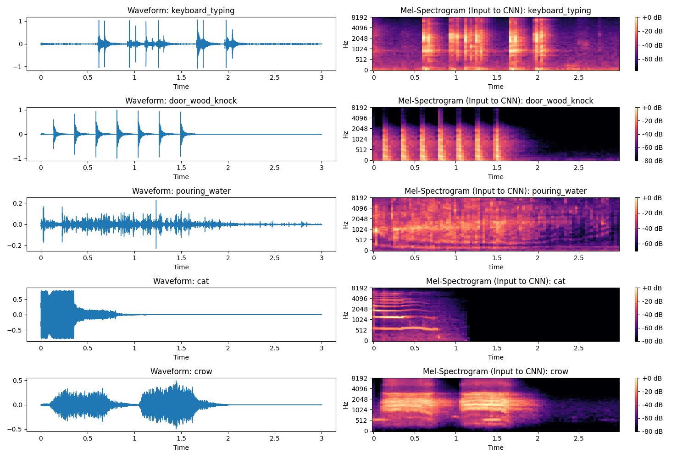

# Visualizing Sound: Spectrogram-based Event Detection & Alert System

A deep learning-based system designed to assist the deaf community by detecting and classifying household sounds (e.g., pressure cooker, doorbell, baby crying) and verifying them through visual spectrogram analysis.



## 🌟 Key Features
*   **Deep Learning Core**: Uses MobileNetV2 Transfer Learning on Mel-Spectrograms.
*   **Personalization**: Few-Shot Learning (Siamese Network) to learn *your* specific sounds.
*   **Indian Context**: Optimized for sounds like Pressure Cookers and Auto-rickshaw horns.
*   **Offline First**: Runs completely on-device using TensorFlow Lite.
*   **Haptic Alerts**: Different vibration patterns for Fire Alarms vs Doorbells.

## 📁 Project Structure
*   `src/models/`: Python code for training CNN, Transfer Learning, and Siamese networks.
*   `src/processing/`: Audio preprocessing, augmentation, and visualization scripts.
*   `src/android/`: Complete Android Studio project (Kotlin).
*   `data/`: Processed datasets.
*   `models/`: Saved `.h5` and `.tflite` models.

## 🚀 How to Run

### 1. Python (Model Training)
Install dependencies:
```bash
pip install -r requirements.txt
```

Train the models:
```bash
python src/processing/prepare_data.py  # Process Audio
python src/models/train_transfer.py    # Train Main Model
python src/models/convert_to_lite.py   # Convert to TFLite
```

### 2. Android (Mobile App)
1.  Open `src/android` in **Android Studio**.
2.  Sync Gradle.
3.  Connect an Android device (Enable USB Debugging).
4.  Click **Run**.

## 📊 Results
*   **Baseline Accuracy**: ~70%
*   **Transfer Learning Accuracy**: >85%
*   **Personalization Accuracy**: >99% on paired samples.

## 👨‍💻 Tech Stack
*   **ML**: TensorFlow, Keras, Librosa, NumPy
*   **Mobile**: Android SDK, Kotlin, TFLite
*   **Tools**: Matplotlib, Pandas
